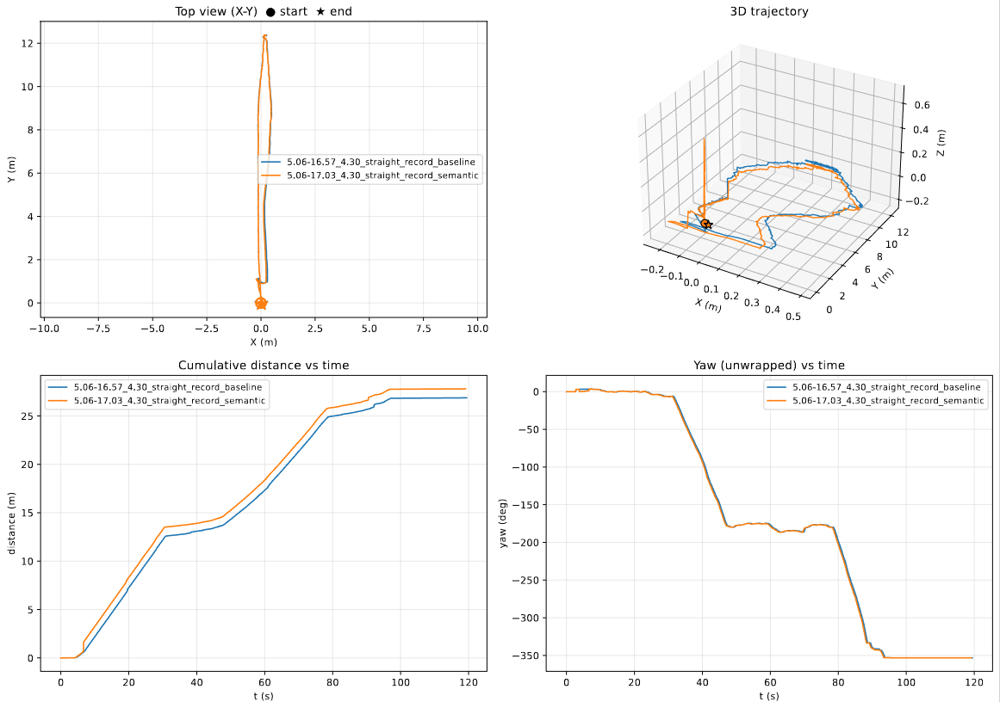
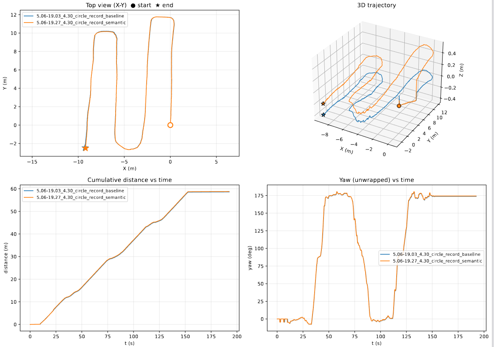
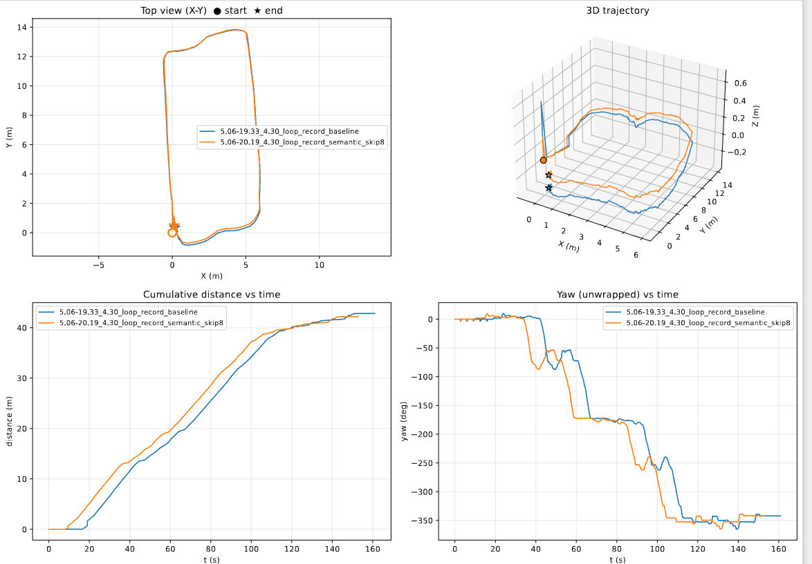

# 视觉SLAM离线回放与数据分析报告 - 果果农庄数据

## 1. 基础信息
- **关联现场实验**：[4.30果果农庄现场实验](4.30果果农庄实验.md)
- **回放与分析日期**：2026年5月7日
- **分析目的**：复盘现场记录的Rosbag数据集，详细分析系统轨迹精度、跟踪稳定性及关键失败节点（Corner Cases），为接下来的算法参数调优和后续实验提供依据。

## 2. 回放配置与参数调整
- **SLAM算法**：改进版ORB-SLAM3 + Deeplabv3+
- **指令/回放倍速**：`[例如：rosbag play xxx.bag -r 0.8]`使用launch文件
- **参数修改记录（对比现场运行）**：
  - 第一次回放相比现场没有调整参数，采用相同的Yaml文件
  - 第二次回放调整了特征点提取数量 `nFeatures` 从 2500 调整为 1500

## 3. 各数据包详细分析

### 3.1 番石榴园直线 (Bag 1 / straight直线掉头)
- **包名**：`2026-04-30_15-59-09_guoguo_fanshiliu_straight1.bag` (~120s, 27m)
- **整体表现**：有语义与baseline完全重合（直线 + 转弯回）。累计路程有微小差异，轨迹形状几乎完全一致。
- **对比数据**：semantic 27.7m / baseline 26.8m（差 1m≈3.5%），yaw 终值完全同步。
- **实验结果**：

### 3.2 火龙果园路线1 - 无闭环 (Bag 2 / circle)
- **包名**：`circle` 数据包 (~200s, 58m)
- **整体表现**：完全重合，几乎看不出两条线的视觉差异。
- **对比数据**：累计路程 semantic ≈ baseline，yaw 终值完全同步。
- **实验结果**：

### 3.3 火龙果园路线2 - 大圈闭环 (Bag 3 / loop)
- **包名**：`loop` 数据包 (~160s, 42m) 带 `_skip8` 标记(跳过起始8s)
- **整体表现**：基于一致的形状过程曲线略有抖动（30s-110s 区间有轻微错位，推测初始时刻不同导致）。
- **对比数据**：末值42m，过程中semantic 跑得略快，但最终完全重合,都可以完成回环检测
- **实验结果**：

## 4. 整体对比结论
**核心结论**：在这三组序列里，Semantic 语义加权对最终位姿**几乎没有产生肉眼可见的差异**。

## 5. 核心问题深度剖析 (为什么 Semantic 与 Baseline 无差异)
通过对场景以及相关参数分析，得出以下 **4 个主要原因**：

1. **类权重在果园场景下分布过于扁平（最主要原因）**
   - 当前配置的类基础权重为：`Bg=0.667, Road=0.733, Sky=0.333, Veg=1.000`。
   - 果园场景中提取的特征点，其绝大多数落在 Veg（树叶/枝条）上 → 权重1.0 → 跟 baseline 完全等价。
   - 极少数落在天空的本来就提不到ORB，落在 Bg/Road 的特征极少，其 0.667/0.733 的降权机制完全被淹没在整体 BA 优化总残差里。
   - **解读**：场景中超过90%的点权重成了 1.0，剩下的10%仅仅是轻微降权，无法有效影响不了原始 BA 优化。

2. **软加权动态范围太窄**
   - `ORBmatcher: dist *= (2.0 - semW)` 的范围在 `[1.0, 1.667]`；`BA setInformation × weight` 影响范围在 `[0.33, 1.0]`。
   - 小范围的调节空间不足以改变 ORB-SLAM3 中原本主导的几何约束。

3. **序列太短 + 系统闭环良好**
   - 三条序列长度仅 25~60m。累积漂移这类“弱效应”需要在长序列里才能被放大。
   - circle 等序列中，ORB-SLAM3 使用"双目 + IMU"的模式，回环检测能力强，直接把漂移误差抹平了，Semantic 起不到改善BA的效果。

## 6. 总结与下一步行动建议 (Semantic验证核心方案)

### 6.1 诊断方案（最小投入获取结论）
1. **定量验证（必须有GT）**：继续调试 Citrus-Farm 数据集（有真值 GT）的 200m+ 长序列，做 baseline vs semantic 的 `evo_ape ATE` 对比：
   - 差距在 1-2cm：算法机制失效，转入 6.2 算法。
   - 差距有 10%+：证明语义有效，仅短序列的可视化上看不出。
   - 部分序列无法完整建图，添加<u>**参数：跟踪时(s)）**</u>作为对比
2. **添加底层日志继续调试**：在 `Optimizer.cc` 的 BA 入口处添加监控 Log，每 N 帧打印一次 **4 类点的真实权重占比分布**。

### 6.2 算法后续进化方向 (中长期 TODO)
1. **修改“静态常数表”**：扩大动态降权范围，比如 Sky `0.1`、Bg `0.4`。对明确的噪点区考虑重启硬剔除策略（如天空区域不参与BA）
2. **落地推进 Phase 6 & Phase 7**：解决行尾突然的“天空主导”（Phase 6），以及对特征稀疏背景点的提权（Phase 7），在网络添加对行尾出现的电线杆等其他特征点稳定的杂物类别，提高权重

### 6.3 下次果园实验备忘
- **GT 替代方案**：现场大量安插可识别的 Waypoint（利用地面标记胶带），补缺果园无 GT 的痛点。
- **其他准备**：务必带标定板获取现场 YAML 参数；降低过弯车速；备驱蚊水！
