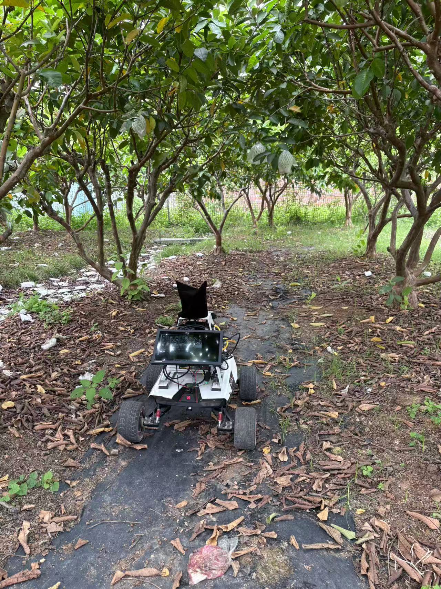
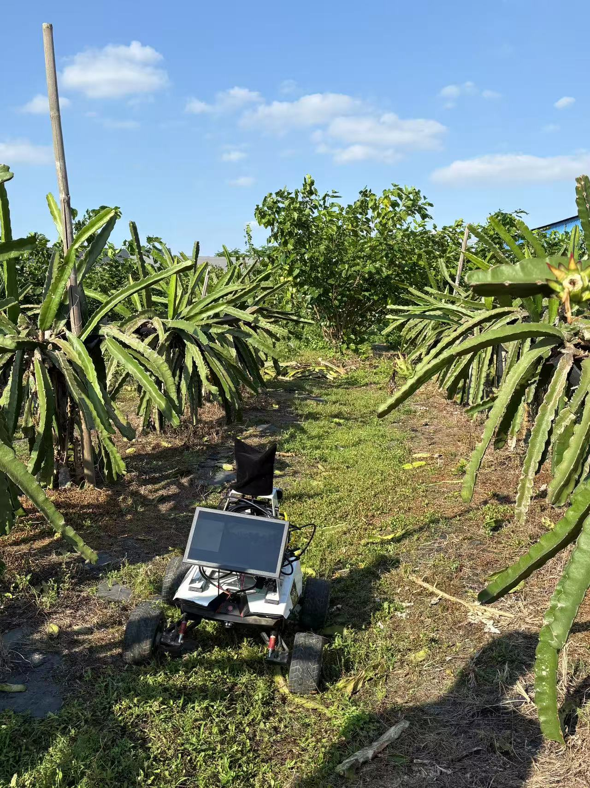
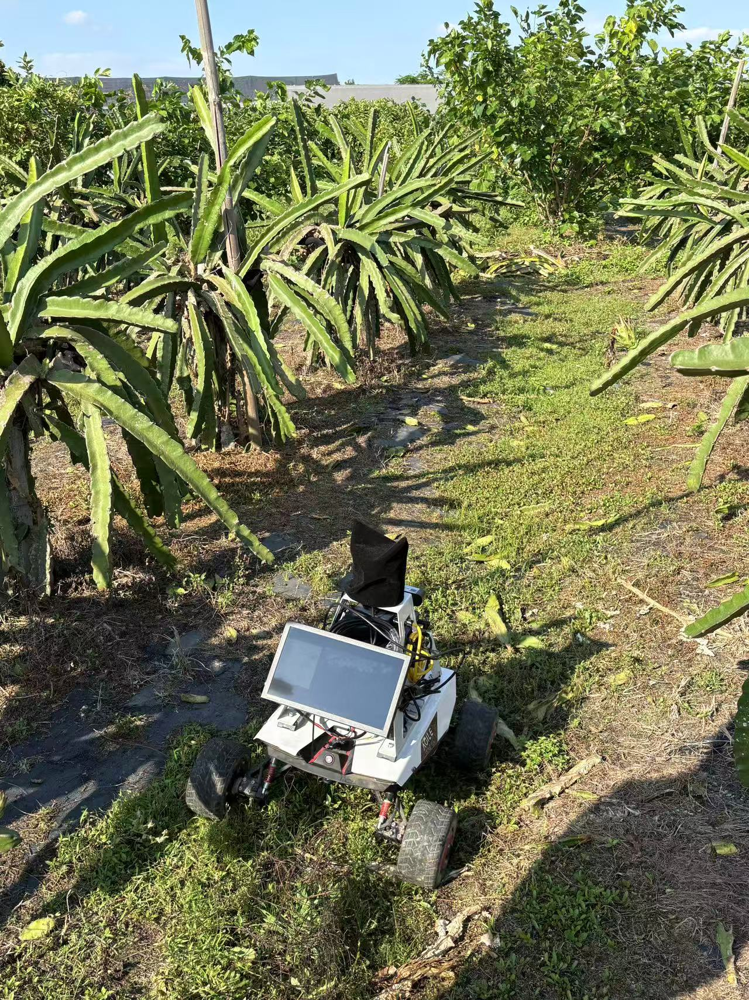

# 视觉SLAM现场实验记录 - 果果农庄

## 1. 实验基本信息
- **日期**：2026年4月30日
- **时间**：14.20-17.30
- **实验地点**：狮山镇果果农庄（番石榴园+火龙果园）不是大棚
- **天气与光照条件**：番石榴园是树荫斑驳，火龙果园是开阔视野
- **实验人员**：GT + 鸡哥

## 2. 实验方案与配置
- **测试方案/尝试次数**：第 2 套方案，第 2 次测试
- **SLAM算法**：改进版ORB-SLAM3 + Deeplabv3+ 四类别（vegetation+road+sky）
- **传感器配置**：
  - 相机设备：ZED2i(参数 720P 30HZ)
  - IMU设备：内置IMU
  - 算力平台：车载NUC11工控机

## 3. 实验路径与环境描述

### 3.1 番石榴园
- **起点**：第一种植行起点
- **终点**：第一行终止点起点，形成闭环
- **大致距离/路线**：来回直线，约24米、包含直角直角转弯
- **环境特征**：纹理稍微丰富，不存在动态物体（行人、车辆）、无反光或弱纹理区域
- **环境图片**：

### 3.2 火龙果园路线1
- **起点**：在种植行偏左
- **终点**：往右间隔两行的末端
- **路线描述**: 没有回环，尝试行驶与citrus-farm类似的轨迹,在每行末尾前一株火龙果90度转弯
- **环境特征**：视野开阔，有电线架、水管等杂物，有高光以及弱纹理区域
- **环境图片**：

### 3.3 火龙果园路线2
- **起点**：在种植行偏左
- **终点**：终点与起始点重合
- **路线描述**: 有回环，完成一个大圈闭合
- **环境特征**：视野开阔，有电线架、水管等杂物，有高光以及弱纹理区域
- **环境图片**：

## 4. 数据记录
- **录制的数据包（Rosbag/数据集介绍）**：
  - 路径与数量：`/home/gt/guoyuan` 目录下，一共三个
  - 示例包名：`2026-04-30_15-59-09_guoguo_fanshiliu_straight1.bag`（番石榴园直线）
  - 大小与时长：示例包为 `9.4 GB`，时长 `119s`（整体包大小在 `8GB-16GB` 之间）
  - 包含的话题（Topics）：
    - 图像数据：`/camera/left/image_rect`、`/camera/right/image_rect`（双目经过矫正图像）
    - IMU数据：`/camera/imu`
    - 真实轨迹（如有RTK/动捕）：无真实轨迹，通过卷尺人工测量
- **实时输出数据**：
  - 轨迹日志：`/home/gt/catkin_ws/src/orb_slam3_ros/output_trajectory/zed2i_live_stereo_inertial/4.30*.bag`
  - 构建的点云/地图：`osa文件未保存`

## 5. 实验结果与现象
- **系统运行状态**：
    - 1.运行平稳，无经常出现掉帧现象
    - 2.偶尔会出现failed to track local map 在转弯出现，依靠imu信息能重定位
- **定位与建图表现**：
  - **跟踪丢失（Tracking Lost）**：没详细记录，后续playback bag重新记录
  - **回环检测（Loop Closure）**：有回环的路段成功触发回环及误差修正良好
  - **建图质量**：稀疏点云

## 6. 问题分析与下一步计划
- **发现的问题**：
  1. record.sh无法同时启动语义版本 
  2. 忘记带标定板，没有完成现场相机标定得到Yaml参数
  3. HDMI线不稳定，在经过坑时会断触  
  4. 蚊子太多，需要驱蚊水
- **后续优化思路**：
  - 在rosbag play 后续数据处理调整特征点提取阈值、提取数量。
- **下一次实验计划**：预计5.8